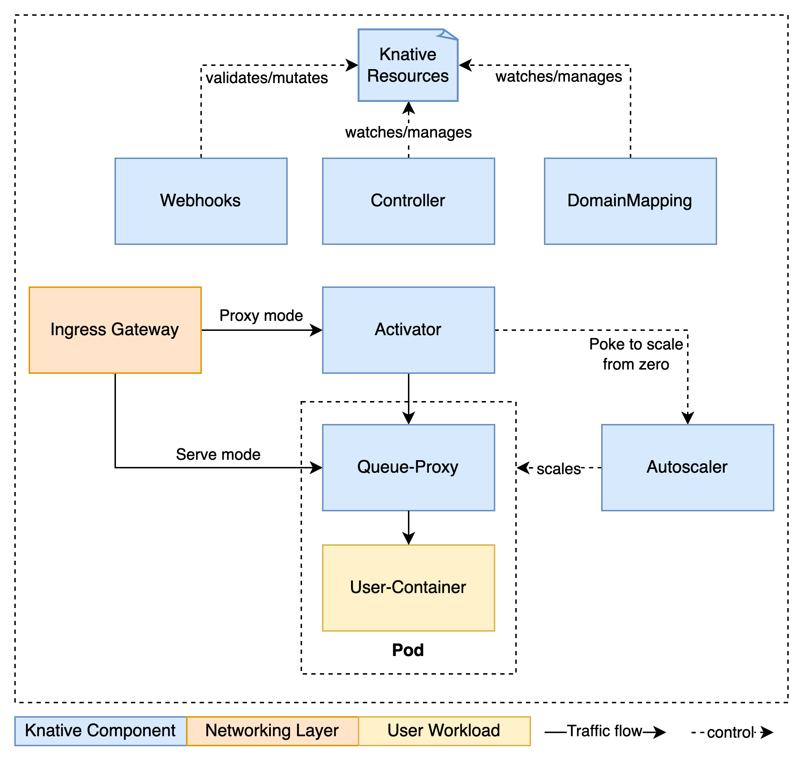

# Passing the bridge

## Watching pods and Knative internals

```bash
watch -n 1 kubectl get pod -n default
```
```bash
watch -n 1 kubectl get podautoscaler -n default
```

## Scale to zero

We already have that with the deployed Service.

```bash
curl http://horse-jaskier.default.10.89.0.200.sslip.io
```

## Scale from zero

> 📝 Per default a service will always be scaled to 1 at creation to verify that it works properly

```bash
kubectl apply -f - <<EOF
apiVersion: serving.knative.dev/v1
kind: Service
metadata:
  name: horse-jaskier
  namespace: default
spec:
  template:
    metadata:
      annotations:
        autoscaling.knative.dev/initial-scale: "0"  
    spec:
      containers:
        - image: quay.io/rlehmann/horse-jaskier
EOF
```

```bash
curl http://horse-jaskier.default.10.89.0.200.sslip.io
```

## How does this work




## More Knative Serving Features

* A/B-, Canary-Deployments, Gradual rollouts
* Tag based routing
* Configuration and Revisions
* Metrics and Observability

For more please refer to the [documentation](https://knative.dev).
