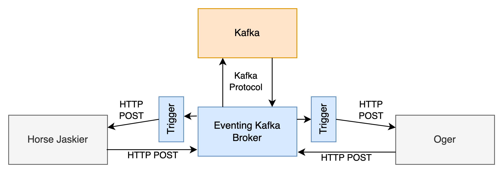
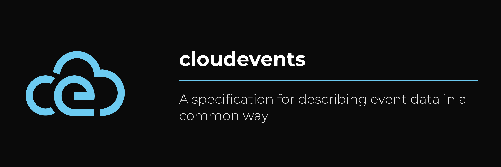

# Big picture




# Update the application to speak CloudEvents



The [cloudevents specification](https://github.com/cloudevents/spec) describes a simplified model for describing event data. 
There are SDKs for multiple languages available, but it is as simple as sending and receiving HTTP requests.

**Sending a CloudEvent**
```golang
jsonBody := []byte(`Knock on the Door`)
bodyReader := bytes.NewReader(jsonBody)

req, err := http.NewRequest(http.MethodPost, brokerURL, bodyReader)
if err != nil {
	// ...
}

req.Header.Add("ce-specversion", "1.0")
req.Header.Add("ce-id", "demo")
req.Header.Add("ce-type", "knock-on-door")
req.Header.Add("ce-source", "horse-jaskier")

client := &http.Client{}
res, err := client.Do(req)
if err != nil {
	// ...
}
```

**Receiving a CloudEvent**
```golang
// ...
http.HandleFunc("/cloudevents", receiveCloudEvent)
// ...
func receiveCloudEvent(w http.ResponseWriter, r *http.Request) {
	reqBody, err := io.ReadAll(r.Body)
	if err != nil {
		// ...
	}
	log.Printf("server: request body: %s\n", reqBody)
}
```

More details on [full source](./horse-jaskier/main.go).


# 3. Receive traffic from Kafka

To receive traffic from Knative Eventing Kafka Broker, we create a `Trigger` to get events to our Knative Service `horse-jaskier`:

```bash
cat <<-EOF | kubectl apply -f -
apiVersion: eventing.knative.dev/v1
kind: Trigger
metadata:
  name: jaskier-door-events
  namespace: default
spec:
  broker: default
  filter:
    attributes:
      type: door-events
  subscriber:
    ref:
      apiVersion: serving.knative.dev/v1
      kind: Service
      name: horse-jaskier
    uri: /cloudevents
EOF
```

# 4. Testing it

We can use the already deployed `horse-jaskier` service. Make sure that you specify the `BROKER_URL` environment variable:

```bash
kubectl apply -f - <<EOF
apiVersion: serving.knative.dev/v1
kind: Service
metadata:
  name: horse-jaskier
  namespace: default
spec:
  template:
    spec:
      containers:
        - image: quay.io/rlehmann/horse-jaskier
          env:
          - name: BROKER_URL
            value: http://kafka-broker-ingress.knative-eventing.svc.cluster.local/default/default    
EOF
```

Then use the UI on `http://<your-domain>/kafka.html` or send it directly using 

```bash
curl -iv http://horse-jaskier.default.10.89.0.200.sslip.io/knock-on-door
```
